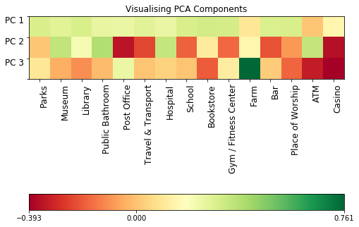

# Introduction

I will be using the FourSquare API in order to gather data concerning the number of different types of venues within a given radius of each London Borough e.g. the number ATMs within 1 kilometre of the centre of Newham.

This work may be of interest to local business who would like to understand areas of london that are similar to places they already do business in. With a hypothesis being that these places may be fruitful for potential stores.


# Data

I'll only be using the FourSquare api, specifically the Explore API, I'll be exploring areas within a fixed radius of London Boroughs.


# Methodology

### Data Gathering
First of all, before using the Foursquare API I started with a list of all the London Boroughs. <br>
Following this, I used `geopy` to geoencode these boroughs in order to obtain the latitude and longitude of the centre of these boroughs.

After this, I used the Foursquare API to create a dataframe. <br>
This dataframe has one row per borough and one column per venue type. Data was gathered using a user-defined functioned which found the sum of each venue type per borough at a given radius from each borough centre.

### Exploratory Data Analysis
Following data gathering I ran calculated some summary statistics and found the distribution of the row-wise standard deviation of the data. This helped me understand the variance of the data on a per borough basis.

This told me the data was quite different within each row.


### Clustering

I clustered this data in order to see what natural groupings form from this using a range of techniques including K Means and Hierarchical Clustering. Furthermore I tested various dimensionality reduction techniques such as t-SNE and Principal Component Analysis in order to visualise this data in lower dimensions.

Principal Component Analysis revealed the features which captured the most variance in the data.


# Results

The results of the clusters are below.
# ```
Label 0
['Barking and Dagenham' 'Barnet' 'Bexley' 'Brent' 'Enfield' 'Harrow'
 'Hillingdon' 'Redbridge' 'Richmond upon Thames' 'Sutton' 'Waltham Forest']
Label 1
['Islington' 'Kensington and Chelsea' 'Westminster']
Label 2
['Lambeth' 'Southwark']
Label 3
['Bromley' 'Croydon' 'Haringey' 'Hounslow' 'Kingston upon Thames'
 'Lewisham' 'Merton' 'Newham' 'Wandsworth']
Label 4
['Camden' 'Ealing' 'Greenwich' 'Hackney' 'Hammersmith and Fulham'
 'Havering' 'Tower Hamlets']
# ```

Looking at the results above we can give qualititative names to the clusters like so:

0. Outerskirts of London
0. Central London
0. South Bank (Cultural)
0. South London

We see the results of the clustering below, the images is shown in two dimensions via Principal Component Analysis. <br>
We see that the South Bank cluster is the most different from the others.


Below we see a visualisation of the Principal Components, this heatmap shows the correlation between the high-dimensional features (x-axis) and the low-dimensional principal components (y-axis).

It's clear from this that venue categories such as Farms and ATMs contribute less to the most important principal component (PC1).


I plotted the distribution of mean scores by label below. <br>
We see that this shows the clusters are suitably different.


The hierarchical clustering results are below.


The resulting map is below.


Let's look specifically at the differents in mean number of venues when comparing the central and suburban clusters.


# Discussion

From the results above it's clear that there is a clear radial difference between central and outer london in venue type.

When looking at the graph above we see this difference is driven primarily differences in the number of transport links, schools and bars.


# Conclusion

We can conclude by reiterating that this analysis shows the natural clusters of borough, showing a clear radial difference. With more time, one could overlay other data on to these clusters such as average income, age etc. to further categorise these parts of London.


```python

```
